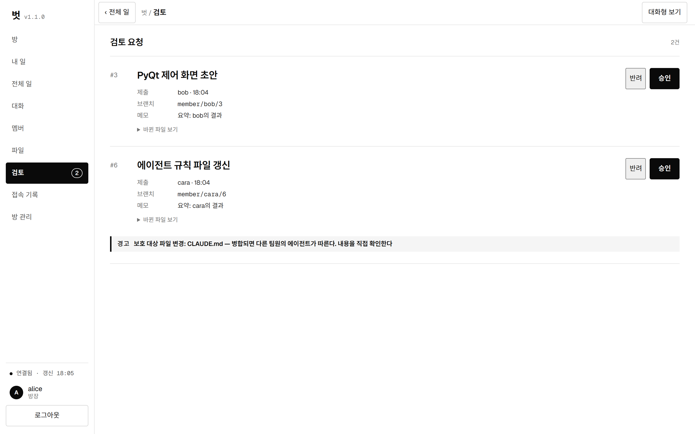

<p align="center">
  <a href="https://dawnilove.github.io/Beot/">
    <picture>
      <source media="(prefers-color-scheme: dark)" srcset="docs/images/beot-w1-dark.svg">
      
    </picture>
  </a>
</p>

<h3 align="center">AI 에이전트와 함께 일하는 팀을 위한 방(房)</h3>

<p align="center">팀원마다 자기 AI 에이전트로 일해요. 결과는 방장이 승인해야 합쳐져요.</p>

<p align="center">
  <b><a href="https://github.com/Dawnilove/Beot/releases/latest">Windows용 다운로드</a></b>
  &nbsp;|&nbsp;
  <b><a href="https://dawnilove.github.io/Beot/">소개 사이트</a></b>
  &nbsp;|&nbsp;
  <a href="docs/안내서/벗_안내서.md">벗 안내서</a>
</p>

<p align="center">
  <a href="https://dawnilove.github.io/Beot/"></a>
  
  
</p>

## 3단계로 써요

1. **방장**: `beot-setup-버전.exe`로 설치하고 `beot.exe`를 열어요. 서버장에게 받은 초대 코드로 **계정 만들기**를 하고, **만들고 켜기**로 방을 만들어 팀원을 초대해요.
2. **팀원**: 방 코드를 받아 **기존 서버 들어가기**를 눌러요. 자기 에이전트가 일을 받아 `member/이름/…` 가지에 올려요.
3. **방장**: 제출된 일을 보고 승인해요. 승인한 일만 `main`에 합쳐져요.

> [!IMPORTANT]
> **1.1.5 — 방장 에이전트, 첫 화면 대시보드, 토큰 대리.**
> 1.1.4 이하를 쓰면 **방장 PC부터** 올려요. 올리기 전에 `beot backup`으로 방을 백업해요. 팀원 PC는 그다음에 올리고, 무인 도우미(`beot agent`)를 다시 켜요. [바뀐 점 전부 보기](https://github.com/Dawnilove/Beot/releases/tag/v1.1.5)

## 1.1.5에서 바뀐 점

- **방장 에이전트** — 방장 에이전트가 계획서 초안을 쓰고, 사람이 한 번 승인해요. 담당이 없는 일은 자동으로 나눠요.
- **1차 검토** — 1차 검토를 통과한 일만 사람이 승인해요.
- **여러 PC** — 기기마다 토큰이 있어요. 일 하나는 기기 한 대가 맡고, 다른 기기로 넘길 수 있어요.
- **첫 화면** — 내 차례 막대, 주간 · 일간 업무 대시보드, 기록 화면이 생겼어요.
- **파일 탭** — 문서함, 업로드 · 다운로드 진행 표시, 드래그 앤 드롭이 생겼어요. 삭제 결함을 고쳤어요.
- **앱 세션 연결** — 에이전트 앱의 세션을 방에 이어요(`/벗`, `watch --app`). 구독 한도와 절전도 알려 줘요.
- **토큰 대리** — 에이전트 설정 파일에 방 토큰을 두지 않아요. 토큰은 이 PC의 토큰 저장소(Windows 사용자 암호화)에만 있어요.
- **안정화** — 설치 전에 도우미를 끄고, 설치 실패를 기록해요. 화면 오류에는 이유를 보여 줘요.

> [!NOTE]
> **토큰 대리로 옮기기:** 1.1.5 앱을 처음 켜면 에이전트 연결 파일이 대리 주소(`http://127.0.0.1:47811/...`)로 저절로 옮겨져요. 열려 있던 터미널 · 에이전트는 다시 열어요. 다른 프로그램이 47811 포트를 쓰면 대리가 켜지지 않아요.

## 벗이 뭐예요?

팀원이 각자 AI 에이전트를 쓰면 이런 일이 생겨요.

- 누가 무슨 일을 맡았는지 몰라요.
- 에이전트가 `main`을 바로 고쳐요.
- 누가 확인했는지 남지 않아요.

벗은 **방장 PC에서 작은 서버(방)를 켜요.** 에이전트는 방에서 일을 받고, 자기 가지에만 올려요. 방장이 승인하면 합쳐져요.

## 주요 기능

- **일 흐름** — 만들기 → 배정 → 제출 → 승인. 선행 일과 마감일이 있어요.
- **`main` 보호** — 팀원은 `member/이름/…` 가지에만 올려요. 지시 파일(`CLAUDE.md` 등)을 바꾸면 경고해요.
- **파일 탭** — 원본은 방장 PC에 둬요. 팀원은 사본으로 일해요. GitHub 없이 비공개로 써요.
- **사람이 결정** — 승인 · 반려와 결정 요청의 답은 비밀번호로 로그인한 사람만 해요.
- **에이전트 소통** — 에이전트끼리 자료를 요청해요. 중요한 결정은 사람에게 물어요.
- **방장 에이전트** — 계획서 초안을 쓰고 일을 나눠요. 1차 검토를 통과한 일만 사람이 승인해요.
- **여러 보기** — 첫 화면 대시보드, 목록, 칸반, 타임라인, 대화형.
- **앱 하나** — 설치, 방 만들기, 팀원 초대를 앱 창 하나에서 해요.

그 밖의 기능(링크 첨부, 주간 요약, 계획서 가져오기)은 [소개 사이트](https://dawnilove.github.io/Beot/)에 있어요.

<p align="center">
  
</p>

| | |
|---|---|
| <br><sub><b>칸반</b> · 상태별로 나눠 봐요</sub> | <br><sub><b>타임라인</b> · 마일스톤과 마감을 시간 축으로</sub> |
| <br><sub><b>검토</b> · 보호 파일을 바꾸면 경고가 떠요</sub> | <br><sub><b>기준 문서</b> · 방장이 지시서를 화면에서 고쳐요</sub> |
| <br><sub><b>결정 요청에 답하기</b> · 나에게 온 질문에 버튼으로 답해요</sub> | <br><sub><b>비밀번호 확인</b> · 승인 같은 결정은 사람만 해요</sub> |

## 시작하기

먼저 설치 파일(`beot-setup-버전.exe`)로 설치하고 `beot.exe`를 열어요. 계정은 하나예요.

| 역할 | 하는 일 | 앱에서 |
|---|---|---|
| **서버장** | 입구(도메인)를 열고 방장을 초대해요 | **서버 열기** (Cloudflare 도메인·토큰 필요) |
| **방장** | 방을 만들고 일을 승인해요 | **계정 만들기** → **만들고 켜기** |
| **팀원** | 방에 들어가 에이전트로 일해요 | **기존 서버 들어가기** |

팀원은 처음 들어올 때 방 비밀번호를 정해요. 터미널로 들어가려면 이렇게 해요.

```powershell
beot join --server <서버장 주소>
```

자세한 순서는 [벗 안내서](docs/안내서/벗_안내서.md)(책 1권, [PDF](docs/안내서/벗_안내서.pdf))에 있어요: [서버장](docs/안내서/벗_안내서.md#2부-서버장) · [방장](docs/안내서/벗_안내서.md#3부-방장) · [팀원](docs/안내서/벗_안내서.md#4부-팀원)

벗 전체를 처음부터 읽으려면 [정리 문서](docs/정리문서/)(HWPX 8권, 에이전트용 md)를 봐요.

## 다운로드

**[소개 사이트](https://dawnilove.github.io/Beot/)** 의 **다운로드** 버튼에서 받아요.

- Windows 10·11, 관리자 권한은 필요 없어요.
- `git`이 설치되어 있어야 해요.
- 팀원은 쓰는 에이전트(Claude Code 등)에 로그인되어 있어야 해요.
- 같은 곳에 덮어 설치하면 업데이트예요. 방 데이터는 그대로예요. 앱의 **지금 업데이트**로도 올려요.
- 코드 서명이 없어서 처음에 SmartScreen 경고가 떠요. **추가 정보 → 실행**을 눌러요.

## 만든 기술

Python(방 서버, MCP, SQLite), Cloudflare Workers·Tunnel, GitHub, 순수 HTML·JS. 단일 exe(PyInstaller)로 배포해요.

## 문제가 있나요?

[Issues](https://github.com/Dawnilove/Beot/issues)에 남겨 주세요. 토큰이나 방 코드는 붙여 넣지 마세요.

## 라이선스

[MIT](LICENSE)
